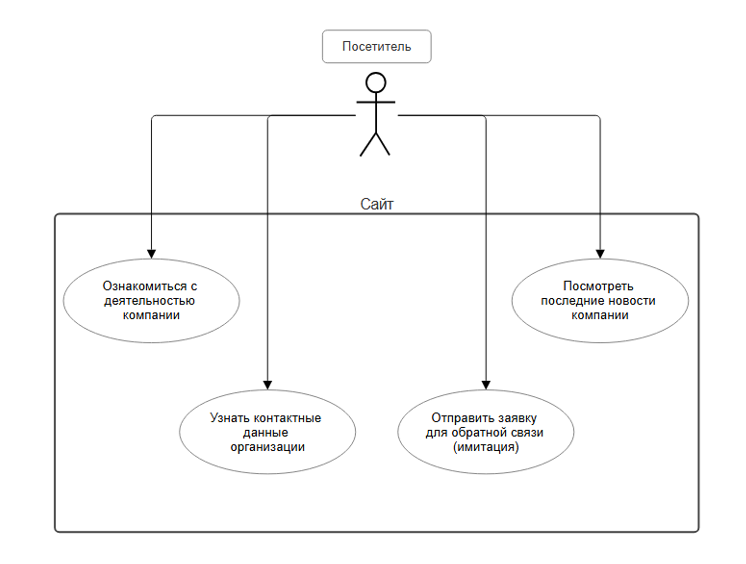
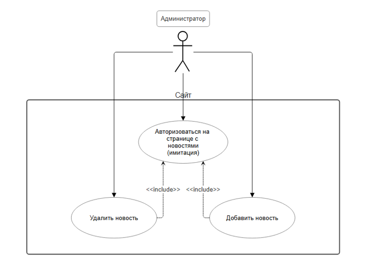
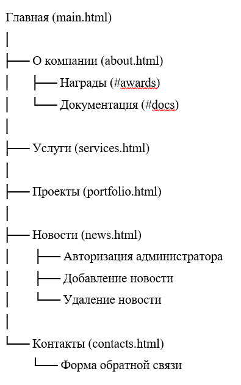
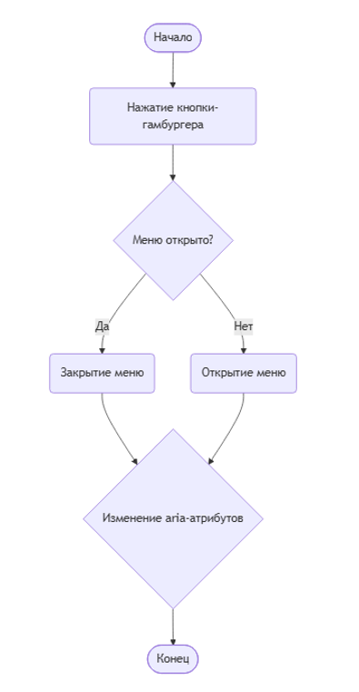
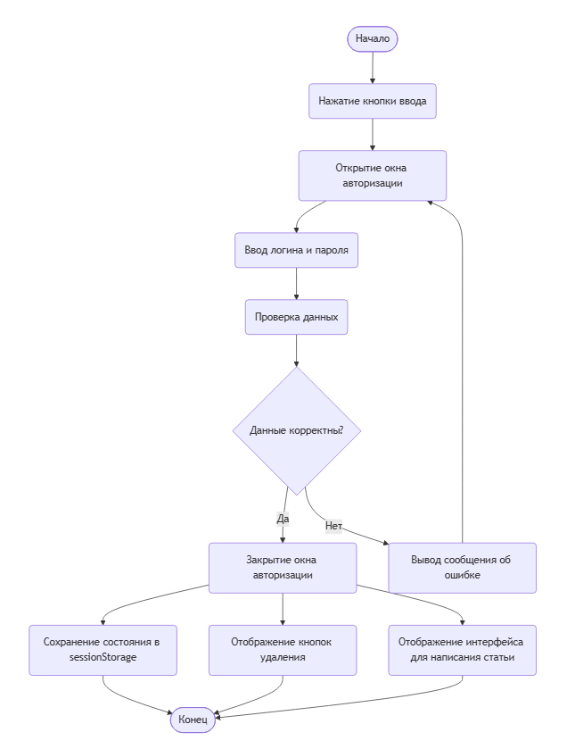
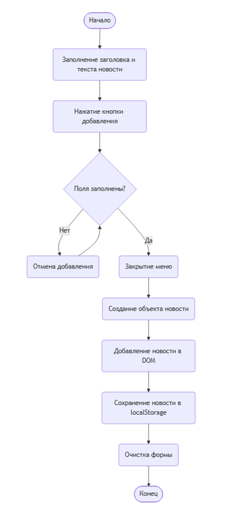
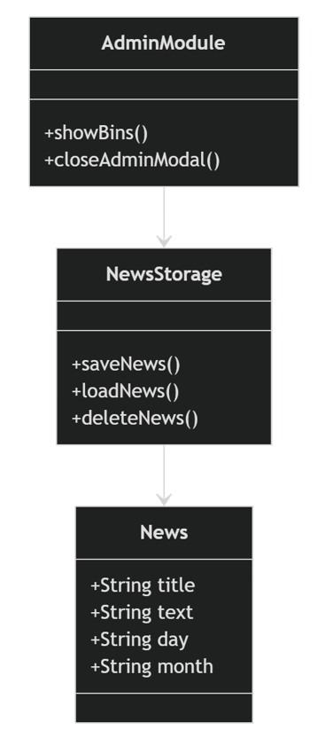

# Сайт для курсового проекта 
Созданный выше сайт был создан в рамках выполнения курсового проекта за 1 учебный год. 
Посмотреть исходный код можно на https://github.com/unlovedcreator/cursovoy
# Данные для авторизации на странице с новостями
Логин: **admin**
 
Пароль: **12345**
# Техническое задание на разработку
## Основание для разработки
Основанием для разработки программного продукта - сайта (далее по тексту - Сайт) является поставленная задача в курсовом проекте.
## Назначение разработки.
Сайт предназначен для удобства ознакомления с деятельностью строительной компании и привлечения клиентов посредством создания программного продукта и исполнения смежных процессов, оговоренных далее в ТЗ:
-	предоставление информации о портфолио, услугах, лицензиях и контактах компании;
-	формирование положительного образа компании через демонстрацию выполненных проектов и полученных наград;
-	обеспечение удобного канала связи для потенциальных заказчиков и партнёров.
## Предмет разработки.
Предметом разработки является многостраничное веб-приложение (Multi-Page Application), реализующее функционал Сайта строительной организации.
## Процесс разработки.
Разработка Сайта включает в себя следующую последовательность действий:
-	проектирование логической структуры разделов и навигации;
-	подготовка графического и текстового контента для наполнения разделов;
-	семантическая вёрстка компонентов интерфейса на языке HTML;
-	описание стилей и анимации взаимодействия с помощью каскадных таблиц CSS;
-	реализация клиентской логики (организация локального хранилища, валидация форм) на языке JavaScript;
-	оптимизация производительности, тестирование и устранение ошибок интерфейса;
-	адаптация веб-интерфейса для устройств с различной шириной экрана;
-	составление сопроводительной документации по проделанной работе.
## Требования к размещению контента на Сайте.
Сайт реализуется по классической многостраничной архитектуре (MPA). Каждый раздел представляет собой самостоятельный HTML-документ, перемещение по сайту осуществляется посредством стандартных гиперссылок.
Обязательные элементы пользовательского интерфейса (единые для всех страниц) приведены в трёх пунктах ниже.
1.	Шапка Сайта состоит из трёх основных частей:
-	иконка дома - располагается в левой части. При нажатии на неё происходит переход на главную страницу (main.html);
-	главное навигационное меню - горизонтальный список разделов в центральной части, обеспечивающий быстрое перемещение по Сайту. При наведении курсора на пункты, содержащие разделы, должно появляться выпадающее подменю. На мобильных устройствах вместо навигационное меню будет выпадающим;
-	контактная панель - располагается в правой части. Содержит номер телефона компании и иконки-ссылки на официальные страницы в социальных сетях.
На устройствах с шириной экрана 768px и меньше главное навигационное меню должно быть скрыто; вместо него в шапке должна находиться кнопка-"гамбургер", позволяющая при нажатии раскрыть данное меню.
2.	Основная область контента представляет собой уникальную для каждой страницы смысловую часть, занимающую пространство между шапкой и подвалом.
3.	Подвал Сайта содержит дублирующую навигацию и краткие контактные данные.
Форма обратной связи: на странице "Контакты" расположена форма для отправки заявки. Она должна содержать обязательные поля: имя, телефон и адрес электронной почты. Сценарий работы формы следующий:
-	пользователь заполняет поля;
-	нажатие на кнопку "Отправить" запускает процедуру клиентской валидации данных на языке JavaScript.
-	при наличии ошибок валидации пользователь видит соответствующие уведомления, а форма не отправляется;
-	при успешном прохождении валидации форма имитирует успешную отправку и выводит соответствующее сообщение. Сохранение данных на сервере в рамках курсового проекта не предусмотрено.
Локальная авторизация: на странице "Новости" через кнопку "Войти" можно попасть в окно авторизации с возможностью введения логина и пароля. При верном заполнении данных открывается доступ к редактированию новостей: их добавлению и удалению. Добавленная новость попадает в локальное хранилище localStorage. Сама авторизация после выхода из сессии сбрасывается.
## Требования к техническим характеристикам Сайта.
-	Технологический стек: разработка ведётся исключительно с использованием HTML5, CSS3 и нативного JavaScript, без использования фреймворков и сторонних библиотек.
-	Архитектура: Сайт реализуется как Multi-Page Application (MPA). Каждая страница Сайта представляет собой отдельный HTML-файл.
-	Организованность кода: не допускается смешивания разметки, стилей и логики в одном файле. Проект должен содержать чётко разделённые файлы и директории:
HTML-файлы страниц в корне проекта;
CSS-файлы в директории css/;
JS-файлы в директории js/;
изображения и иконки в директории img/;
вариативные шрифты в папке fonts/.
-	Обобщение кода: стили и скрипты, отвечающие за общее для всех страниц оформление и поведение (шапка, подвал, меню), должны быть вынесены в отдельные файлы (style.css, main.js) и подключаться ко всем HTML-документам.
-	Корректность подключения: все элементы (таблицы стилей, скрипты, шрифты, изображения) должны иметь рабочие относительные или абсолютные пути и загружаться без ошибок.
## Список страниц и разделов Сайта.
Ниже представлен наглядный список страниц и разделов сайта, которые необходимо реализовать в рамках проекта, и информация, которой необходимо их наполнить.
1)	Главная (main.html).
-	Презентационный блок с ссылкой на контакты.
-	Сетка фотографий объектов компании.
-	Блоки-ссылки на ключевые разделы ("Наши услуги", "Портфолио").
2)	О компании (about.html).
-	Краткое описание и миссия компании.
-	Структурированный список достижений, побед в конкурсах.
-	Ссылки для ознакомления с разрешительными документами на ведение строительной деятельности.
3)	Услуги (services.html) - описание направлений деятельности компании.
-	Генеральный подряд.
-	Проектирование зданий и сооружений. 
-	Реставрация построек.
4)	Проекты (portfolio.html): каталог реализованных проектов. Каждый проект представлен карточкой с фотографией и кратким описанием.
5)	Новости (news.html). 
-	Лента последних событий и анонсов компании, отсортированных по дате.
-	Возможность локальной авторизации для управления новостной лентой.
6)	Контакты (contacts.html). 
-	Контактная информация.
-	Интерактивная форма для связи с компанией с валидацией полей на JavaScript.
## График выполнения работ: с 02.02.2026 по 23.05.2026.
Приведённые в техническом задании требования к исполнению проекта являются обязательными для исполнения.
# Диаграммы и схемы
## Диаграммы вариантов использования
  
Диаграмма вариантов использования актора "Посетитель"
___
  
Диаграмма вариантов использования актора "Администратор"
___
## Иерархическая структура сайта 

___
## Диаграммы деятельности
  
Диаграмма деятельности "Открытие мобильного меню"
___
  
Диаграмма деятельности "Авторизация админстратора"
___
  
Диаграмма деятельности "Добавление новости админстратором"
## Диаграмма классов и сущностей
